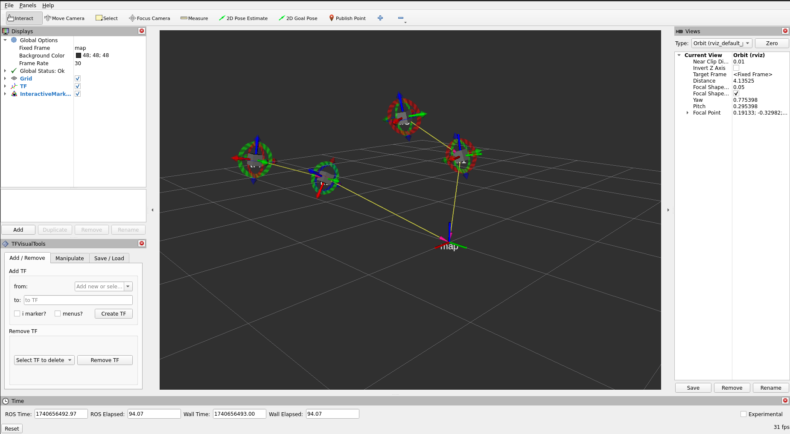
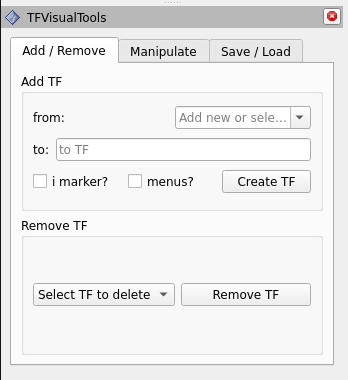
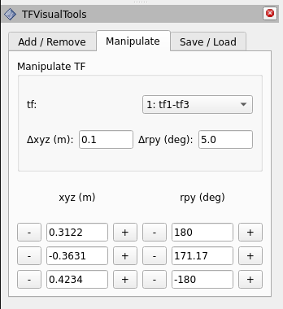
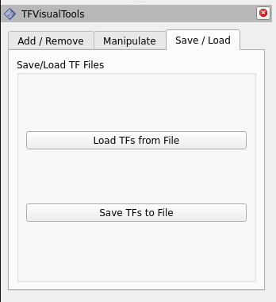

# TF Visual Tools

Easily move `\tf` frames in rviz2 around using your keyboard or mouse. Use as a simple calibration-by-eye tool or add menus and interative markers to create customized functionality.


Screenshot of the TF Visual Tools GUI.


This open source project was ported by [Gokhul Raj Ravikumar](https://github.com/Gokhulraj6200) at [Fraunhofer IIS/EAS](https://www.eas.iis.fraunhofer.de/).
Porting was done from ROS 1 Kinetic to ROS 2 Humble. The original kinetic version can be found [here](https://github.com/PickNikRobotics/tf_visual_tools). 

## Install

### Build from Source

To build this package, ``git clone`` this repo into a [ros2 workspace](https://docs.ros.org/en/humble/Tutorials/Beginner-Client-Libraries/Creating-A-Workspace/Creating-A-Workspace.html) and be sure to install necessary dependencies by running the following command in the root of your colcon workspace:

    rosdep install -y --from-paths src --ignore-src --rosdistro humble
## Usage of TF Visual Tools:

* Start Rviz and add the TF Visual Tools GUI to Rviz: `Panels > Add New Panel`
* Then select the TF Visual Tools GUI: `tf_visual_tools/TFVisualTools`
* Start the TF publisher: `ros2 run tf_visual_tools tf_publisher_node`

These steps are already completed when running `ros2 launch tf_visual_tools tf_publisher.launch.py`

### Creating and Removing TFs


#### To create a TF:
1. select a TF from the `from:` dropdown list or type a new name.
2. enter a name for the TF in the `to:` line.
3. check whether you would like the TF to have an [interactive marker](http://wiki.ros.org/rviz/Tutorials/Interactive%20Markers%3A%20Getting%20Started) associated with it.
4. check whether you would like to attach menu options to your interactive markers. If you do want menus, you will be prompted to select a text file that contains the menu titles.
5. click `Create TF`.

**Note:** see the `File Formats` section for details about file format.

**Note:** see the `Interactive Markers and Menu Selections` for details about using the menu items.

#### To remove a TF:
1. select the TF from the dropdown list.
2. click `Remove TF`

### Interactive Markers and Menu Selections

Due to limitations in the Interactive Markers package, all interactive markers will have menus if enabled and all menus will have the same choices.

For each menu item, a publisher will be created with the topic name:

For example: 

* Items without sub menus: `/imarker/menu_item_B`
* Items with sub menus: `/imarker/menu_item_A_sub_entry_1`

When the menu items are selected, a value of `true` will be published to the corresponding topic. Create a subscriber in your own code to handle menu selections.

### Manipulating TFs


The TFs you create can be manipulated through the GUI or the keyboard.

#### Manipulation with the GUI:
1. select the TF that you would like to manipulate from the dropdown list.
2. set the individual degree of freedom values or use the `+` and `-` buttons to increment the desired degree of freedom. The incrementation is determined by values set in `Delta xyz` and `Delta rpy`.

#### Manipulation with the Keyboard:
1. Select the TF that you would like to manipulate from the dropdown list.
2. Use the following commands to manipuate the TF:

```
Move: X Y Z R P Yaw
-------------------
+     q w e r t y
-     a s d f g h
fast  u
med   i
slow  o
```

**Note:** The `Manipulate` tab must have focus. If the keyboard commands are not working, try clicking the tab again as it probably lost focus.

#### Manipulation with the Interactive Markers:
1. Interactive Marker positions are changed by dragging either the grey box or grabbing one of the arrows or rings to change position or rotation of a single degree of freedom.

### Saving and Loading TFs


These buttons will either save or load a group of TFs.

## File Formats

There are two types of files used in the `tf_visual_tools` package:

* saved TFs
* interactive marker menus

### Saved TF file format

```
#ID FRAME_ID CHILD_FRAME_ID X Y Z ROLL PITCH YAW
# (comment line)
# space delimeter
0 map tf1 1 -0.38627 -0.277768 0.489805 0 -0 0
1 tf1 tf3 1 0.267982 -0.515831 0.31561 0 -0 0
... and so on ...
```

`ID` - an integer id for the frame.

`From` and `To` - strings with the corresponding TF names.

`IMarker` and `Menus` - bool (0 or 1) indicating whether the TF has an interactive marker and menus.

`X`, `Y`, `Z`, `ROLL`, `PITCH`, `YAW` - doubles corresponding to the TFs degrees of freedom.

### Interactive Marker Menus

```
# example menu file
# (shebang anywhere in line comments line)
# FORMAT: (supports only 1 sub level, sub menus cannot have sub menus) 
# (num sub menus), menu title 
# submenu title
# very little error checking done... so check your input.
3, menu item A
sub entry 1
sub entry 2
sub entry 3
0, menu item B
0, menu item C
2, menu item D
sub entry 1
sub entry 2
```